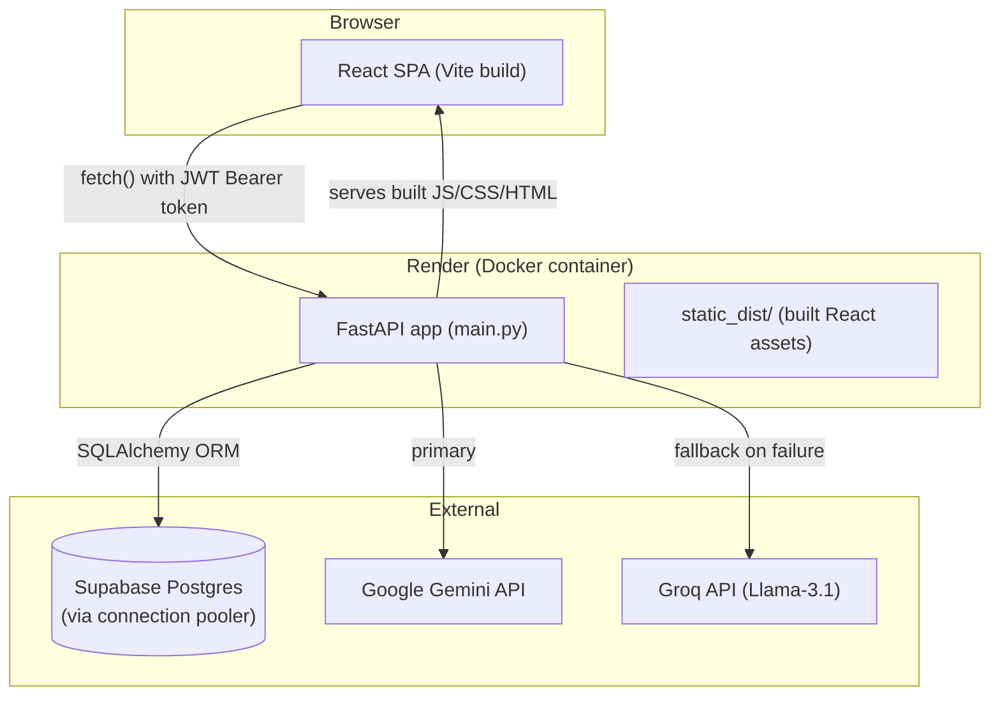
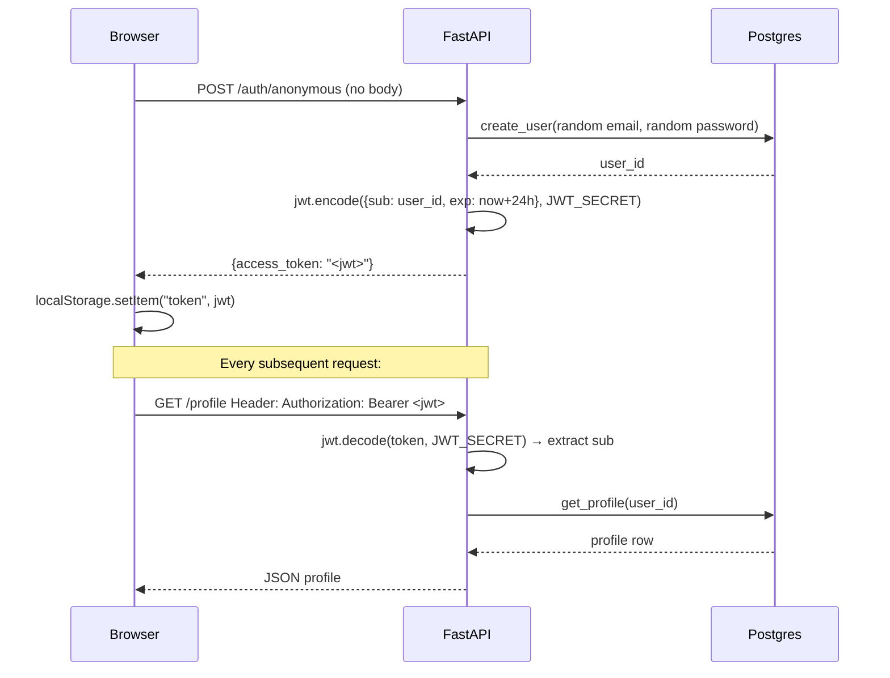
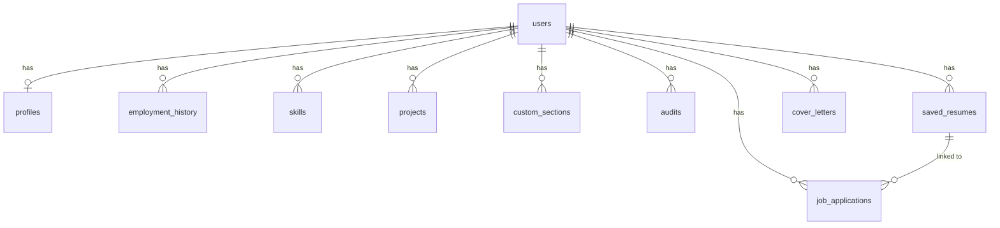

# Study Guide: Career Intelligence Platform

This document explains the project end-to-end — not just *what* it does, but *why* it's built this way, what concepts each piece teaches, and how to defend every design decision in an interview. Read it top to bottom once, then use it as a reference. By the end you should be able to rebuild this from scratch.

---

## 1. The 30-Second Pitch (memorize this)

> "It's an AI-powered career toolkit — resume tailoring, ATS scoring, cover letter generation, and an application tracker — built on FastAPI and React with a Postgres backend. No login is required to use it; the app issues an anonymous session automatically, and users can optionally link an email/password later to access their data from another device. The interesting engineering bits are the two-stage LLM fallback architecture (Gemini → Groq) for high availability, a deterministic post-hoc validator that fact-checks the AI's own claims against the source text to catch hallucinations, and a Docker multi-stage build that compiles the React frontend and serves it from the same FastAPI process — one deployable unit, free-tier hosting end to end."

That single paragraph should be your answer to "tell me about a project." Everything below explains the parts of it.

---

## 2. System Architecture



**Why a single deployable instead of two services (frontend + backend)?**
Simpler free-tier deployment. Render's free tier is per-service; one Docker container serving both the API and the static frontend means one service, one URL, no CORS configuration needed (same origin), and no second free-tier slot consumed. The tradeoff: frontend changes require a full container rebuild instead of an independent static-host deploy. For a small/personal-scale app, that tradeoff is worth it.

---

## 3. Backend: FastAPI Fundamentals

### 3.1 Why FastAPI over Flask/Django?

- **Async-native**: built on Starlette/ASGI, so I/O-bound work (calls to Gemini/Groq, DB queries) doesn't block the event loop the way sync Flask would by default.
- **Pydantic validation for free**: request bodies are typed Python classes; FastAPI validates and parses JSON into them automatically and returns a 422 with a clear error if the shape is wrong. No manual `request.json()` parsing and manual validation.
- **Automatic OpenAPI docs**: every route gets interactive docs at `/docs` with zero extra code, because the type hints *are* the schema.
- **Dependency Injection via `Depends`**: this is the concept worth understanding deepest (see 3.3).

### 3.2 Anatomy of a route

```python
@app.post("/resume/build")
@limiter.limit("5/minute")
def build_resume(request: Request, data: BuildResumeRequest, user_id: int = Depends(get_current_user_id)):
    profile = database.get_profile(user_id)
    ...
    return result
```

Breaking this down:
- `@app.post("/resume/build")` — registers the route + HTTP verb. FastAPI builds its routing table from these decorators at import time.
- `@limiter.limit("5/minute")` — a second decorator (from `slowapi`) wraps the rate limiting logic *around* the route. Decorator order matters: this one needs to see the raw `Request` object, which is why `request: Request` is a required parameter when this decorator is present.
- `data: BuildResumeRequest` — a Pydantic model (see 3.3). FastAPI reads the request body, validates it against this class, and gives you a typed Python object instead of a raw dict.
- `user_id: int = Depends(get_current_user_id)` — this is dependency injection. `get_current_user_id` is itself a function that takes the request's JWT, decodes it, and returns the user's ID — or raises an `HTTPException(401)` if the token is missing/invalid/expired. FastAPI calls this *for every request to this route, before your function body runs*. If it raises, your function never executes. This is how every protected endpoint enforces auth with one line, instead of repeating `if not authenticated: raise ...` in every handler.

### 3.3 Pydantic models — why typed request bodies matter

```python
class BuildResumeRequest(BaseModel):
    job_description: str
```

Without this, you'd manually do `body = await request.json(); jd = body.get("job_description")` and handle every possible malformed-input case yourself (missing key, wrong type, etc.). With Pydantic, malformed input is rejected automatically with a structured error, before your function body even runs. This is the same idea as DTOs (Data Transfer Objects) in Java/C# backends, or `struct` validation in Go — define the *shape* of valid input once, get validation for free everywhere that shape is used.

### 3.4 JWT Authentication — full flow



**What a JWT actually is**: three base64-encoded JSON segments separated by dots — `header.payload.signature`. The payload (here, `{"sub": "123", "exp": 1234567890}`) is *not encrypted*, just encoded — anyone can decode and read it (try pasting one into jwt.io). What makes it trustworthy is the **signature**: the server signs `header.payload` with a secret key (`JWT_SECRET`) using HMAC-SHA256. When a request comes in, the server re-computes the signature from the payload and compares it to the one in the token. If anyone tampers with the payload (e.g. changes `sub` to someone else's user ID), the signature won't match anymore, and `jwt.decode()` raises `JWTError`.

This is **stateless auth**: the server doesn't store sessions anywhere. Anyone with a validly-signed token *is* authenticated, full stop — no database lookup needed to check "is this session still valid." (The tradeoff: you can't easily revoke a single token early without a denylist, which this project doesn't implement — JWTs here just expire after 24h.)

**Why `python-jose` and not rolling your own**: implementing JWT signing/verification by hand is the kind of thing where a one-character bug becomes a security hole (e.g. forgetting to verify the algorithm, allowing `alg: none` tokens). Always use a maintained library for cryptographic primitives.

### 3.5 The "no login required" pattern (anonymous sessions)

This is the most unusual design decision in the project, worth being able to explain clearly:

```python
@app.post("/auth/anonymous")
def create_anonymous_session(request: Request):
    email = f"anon-{uuid.uuid4()}@anon.local"
    password = secrets.token_hex(16)
    database.create_user(email, password)
    user_id = database.verify_login(email, password)
    token = create_access_token(user_id)
    return {"access_token": token, "token_type": "bearer"}
```

Every "user" in the database is a real row with a real (random, unguessable) email and password hash — the system doesn't know or care that nobody will ever type that password. The React app calls this endpoint automatically on first load (see `AuthContext.jsx`), stores the JWT in `localStorage`, and from that point on the user *is* authenticated exactly like someone who signed up normally — same database tables, same foreign keys, same endpoints.

**The upgrade path**: `POST /auth/link-account` takes the *currently authenticated* (anonymous) user and replaces their random email/password with a real one the user chose:

```python
def set_user_credentials(user_id, email, password):
    existing = session.query(User).filter(User.email == email, User.id != user_id).first()
    if existing:
        return False  # email taken
    session.query(User).filter(User.id == user_id).update({"email": email, "password_hash": hashed})
```

Same `user_id`, same data, now reachable from any device via a normal login. This is a neat trick: you get "frictionless onboarding" (no signup wall) *and* "data portability" (optional account) without maintaining two separate code paths or data models — an anonymous user and a "real" user are literally the same kind of row.

### 3.6 Password hashing with bcrypt

```python
salt = bcrypt.gensalt()
hashed = bcrypt.hashpw(password.encode("utf-8"), salt)
# ... later, to verify:
bcrypt.checkpw(password.encode("utf-8"), stored_hash.encode("utf-8"))
```

**Never store plaintext passwords.** bcrypt is a deliberately *slow* hashing algorithm (unlike SHA-256, which is fast — bad for passwords, good for checksums). Slowness is the point: it makes brute-forcing a stolen password database computationally expensive. The "salt" is random data mixed into each hash so two users with the same password get different hashes, defeating precomputed rainbow-table attacks. `bcrypt.gensalt()` generates a fresh random salt per call; it's stored *inside* the resulting hash string itself, so `checkpw` doesn't need it passed separately.

### 3.7 Rate limiting

```python
limiter = Limiter(key_func=get_remote_address)
app.state.limiter = limiter
app.add_exception_handler(RateLimitExceeded, _rate_limit_exceeded_handler)

@app.post("/resume/build")
@limiter.limit("5/minute")
def build_resume(request: Request, ...):
```

`slowapi` (a FastAPI port of Flask-Limiter) tracks request counts per key — here, `get_remote_address` means "per client IP" — in an in-memory store, and returns HTTP 429 once the limit is exceeded within the rolling window. **Why this matters here specifically**: because there's no login wall, *anyone* can hit `/resume/build`, which calls a paid-ish (free-tier-limited) external AI API. Without a rate limit, a single bad actor (or a buggy frontend retry loop) could burn through the whole API quota for every user. This is a cost/abuse control, not a security feature per se — but at scale it becomes both.

**Limitation worth knowing**: in-memory rate limiting doesn't survive a restart and doesn't share state across multiple server instances (if you horizontally scaled this, each instance would have its own counter). A production system at scale would use Redis as the shared counter store instead.

---

## 4. Database Layer

### 4.1 SQLAlchemy ORM — the ORM pattern

```python
class User(Base):
    __tablename__ = "users"
    id = Column(Integer, primary_key=True, autoincrement=True)
    email = Column(String, unique=True, nullable=False)
    password_hash = Column(String, nullable=False)
    created_at = Column(DateTime, nullable=False)

    profile = relationship("Profile", uselist=False, back_populates="user", cascade="all, delete-orphan")
```

An ORM (Object-Relational Mapper) lets you describe database tables as Python classes and rows as Python objects, instead of writing raw SQL strings everywhere. `Column(...)` defines a table column; `relationship(...)` defines how Python objects reference each other (here, `user.profile` gives you the related `Profile` row without writing a JOIN by hand).

**Why an ORM instead of raw SQL**: type safety (catch typos at "compile" time via the IDE, not at runtime), automatic SQL injection protection (parameters are always escaped), database portability (the same code works against SQLite locally and Postgres in production — this project actually does exactly that for local testing vs. Supabase in prod), and migrations tooling (not used here, but Alembic builds on SQLAlchemy models).

### 4.2 Foreign keys and cascading deletes

```python
user_id = Column(Integer, ForeignKey("users.id", ondelete="CASCADE"), nullable=False)
```

`ondelete="CASCADE"` is a **database-level** constraint (not just an ORM convenience) — when SQLAlchemy runs `Base.metadata.create_all()`, it generates real SQL like:
```sql
user_id INTEGER REFERENCES users(id) ON DELETE CASCADE
```
This means if you `DELETE FROM users WHERE id = 5`, Postgres itself automatically deletes every row in every other table that references `user_id = 5` — profiles, skills, saved resumes, job applications, everything. This is how `DELETE /account` works with one line of Python (`session.query(User).filter(User.id == user_id).delete()`) and correctly wipes 11 tables' worth of related data: the database does the cascading, not application code looping over every table.

### 4.3 The schema (11 tables)



One `users` row is the root; everything else hangs off it via `user_id` foreign keys. This is a standard "tenant-per-user" relational design — every query that fetches a user's data filters `WHERE user_id = ?`, which is also why row-level authorization is simple here: a JWT proves *who* you are, and every database function takes that `user_id` and only ever touches rows matching it.

### 4.4 Why Postgres over SQLite/MongoDB

- **SQLite**: great for local dev/testing (this project actually swaps to a local SQLite file for fast local verification — see `DATABASE_URL=sqlite:///./test.db`), but its single-file-on-disk model doesn't survive container restarts/redeploys on most free hosting, and doesn't handle concurrent writes from multiple instances well.
- **MongoDB/NoSQL**: this data is inherently relational — a user *has* employment history, *has* skills, audits *reference* a user. Modeling that in a document store means either deep nesting (hard to query "all skills across users") or manual reference-following (re-inventing what a relational DB already does). When your data has clear one-to-many relationships and you need transactional consistency (e.g. deleting a user should atomically delete all their data), Postgres is the right default.

### 4.5 The Supabase pooler gotcha (real production lesson)

Supabase's *direct* Postgres connection host (`db.<project>.supabase.co`) is IPv6-only on the free tier, which many networks (including, initially, this deployment) can't route to — DNS resolution literally fails. The fix is to use Supabase's **connection pooler** (PgBouncer under the hood) instead, which has an IPv4-reachable hostname. But PgBouncer in *transaction* pooling mode (port 6543) doesn't support **server-side prepared statements**, which `psycopg` (the Postgres driver) uses by default for performance. Symptom: `DuplicatePreparedStatement` errors on the second request. Fix:
```python
engine = create_engine(DATABASE_URL, connect_args={"prepare_threshold": None})
```
This tells psycopg to never use server-side prepares, trading a small performance cost for compatibility with the pooler. **The broader lesson**: connection pooling and prepared statements are a classic incompatibility across many DB drivers/poolers — if you ever see "prepared statement already exists" errors against a pooled connection, this is almost always the cause.

---

## 5. AI Integration

### 5.1 The fallback cascade pattern

```python
def analyze_with_gemini(prompt):
    response = gemini_client.models.generate_content(model="gemini-2.5-flash", contents=prompt)
    return clean_json_string(response.text)

def analyze_with_groq(prompt):
    chat_completion = groq_client.chat.completions.create(
        messages=[{"role": "user", "content": prompt}],
        model="llama-3.1-8b-instant",
        response_format={"type": "json_object"},
    )
    return chat_completion.choices[0].message.content

def analyze_resume(resume_text, job_description, role_level):
    prompt = f"""..."""
    try:
        return json.loads(analyze_with_gemini(prompt))
    except Exception:
        try:
            return json.loads(analyze_with_groq(prompt))
        except Exception:
            raise Exception("All AI servers are currently busy. Please try again in 1 minute.")
```

This is a **circuit-breaker-adjacent pattern** (not a true circuit breaker — there's no state tracking "Gemini has been failing, skip it for the next N minutes," every call just tries Gemini fresh) — call the primary provider, and on *any* exception (rate limit, timeout, malformed response), fall through to a secondary provider with a different underlying model. The two API providers are independent companies with independent infrastructure, so the chance of *both* being down simultaneously is much lower than either alone. This is the same high-availability principle as having two ISPs, or AWS multi-region failover, applied to a third-party API dependency you don't control.

**Why JSON-mode prompting**: both prompts explicitly say `Return ONLY a single valid JSON object with the following structure: {...}` and Groq's call additionally sets `response_format={"type": "json_object"}` (a feature where the provider's API guarantees syntactically valid JSON output — Gemini's API call here doesn't have an equivalent flag, hence `clean_json_string()` stripping markdown code fences the model sometimes still wraps the JSON in). The general technique — describe the exact schema you want in the prompt, then parse the response as structured data instead of free text — is what makes LLM output usable as part of a programmatic pipeline instead of just chat text.

### 5.2 Anti-hallucination prompting

```
STRICT ANTI-HALLUCINATION RULES:
1. DO NOT invent or fabricate any metrics, percentages, companies, degrees, or skills
   that are not explicitly stated in the User Profile Data.
2. You may rephrase, reformat, and reorganize the user's existing experience to highlight
   relevance to the Job Description, but you must remain factual.
3. If the user lacks a critical skill mentioned in the JD, DO NOT add it to their resume.
```

LLMs are next-token predictors — they will confidently generate plausible-sounding but false content ("hallucinate") unless explicitly constrained, because nothing in their training inherently distinguishes "this is a known fact" from "this is a statistically likely continuation." Putting explicit negative constraints in the system prompt measurably reduces (does not eliminate) this, because it shifts the model's "plausible continuation" toward "constrained rewrite of given facts" rather than "creative completion." This is a real, current limitation of LLMs worth being able to discuss in an interview — prompting reduces but does not solve hallucination, which is exactly why the next concept exists:

### 5.3 The deterministic validator (`validator.py`)

```python
def validate_missing_keywords(resume_text, ai_missing_keywords):
    text_lower = resume_text.lower()
    truly_missing, false_alarms = [], []
    for keyword in ai_missing_keywords:
        if keyword.lower() in text_lower:
            false_alarms.append(keyword)  # AI claimed it's missing, but it's actually there — hallucination caught
        else:
            truly_missing.append(keyword)
    return {"truly_missing": truly_missing, "false_alarms": false_alarms}
```

This is the most important concept-level idea in the whole project: **don't trust the AI's claims about objective facts — verify them with plain deterministic code.** The AI says "you're missing keyword X." This function does a dumb, 100%-reliable case-insensitive substring search against the *actual* resume text to check if that's even true. If the AI hallucinated (claimed something is missing when it's actually present), this catches it before the user ever sees the false claim. The general pattern — **LLM for fuzzy/creative work, deterministic code for anything checkable** — is the right mental model for building reliable systems on top of unreliable-by-nature LLM output. Never let an LLM be the sole source of truth for something a regex or a database query could verify instead.

### 5.4 PII sanitization before sending to the LLM (`sanitizer.py`)

```python
text = re.sub(r'[a-zA-Z0-9._%+-]+@[a-zA-Z0-9.-]+\.[a-zA-Z]{2,}', '[EMAIL REDACTED]', text)
text = re.sub(r'\(?\d{3}\)?[-.\s]?\d{3}[-.\s]?\d{4}', '[PHONE REDACTED]', text)
```

Before sending raw resume text to a third-party AI API for the *audit* pipeline, emails/phones/URLs get regex-redacted. **Why this matters**: third-party LLM providers' terms of service vary on whether/how long they retain or could use submitted data, and minimizing what PII leaves your system is a basic privacy practice — send only what's needed for the task. (Note: the resume *builder* pipeline doesn't sanitize because it needs the user's own contact info to reproduce it in the output resume — sanitization is applied specifically to the audit pipeline, where only the *content* of the resume, not the identity behind it, needs to reach the LLM.)

---

## 6. Document Generation

### 6.1 Server-side HTML templating → PDF (Jinja2 + xhtml2pdf)

```python
env = Environment(loader=FileSystemLoader("templates"))
tpl = env.get_template(f"{template}.html")
html_content = tpl.render(name=..., skills=..., experience=..., projects=...)
pisa.CreatePDF(html_content, dest=output_file)
```

Jinja2 is a templating engine: you write normal HTML with `{{ variable }}` placeholders and `` loops, and `.render(**data)` substitutes real data in, producing a plain HTML string. `xhtml2pdf` (the `pisa` module) then converts that HTML+CSS string into an actual PDF file. This is a common pattern for generating consistent-looking documents (invoices, resumes, reports) from structured data: write the layout once in HTML/CSS (which most developers already know), then render N different data sets through it.

```html

  <div class="header-row"><span class="left">{{ job.title }} | {{ job.company }}</span></div>
  <ul><li>{{ bullet }}</li></ul>

```

This project ships **3 separate templates** (`modern.html`, `classic.html`, `minimal.html`) that all consume the *same* normalized data shape — that's the key design choice: define one data contract (`{name, phone, email, summary, skills: [], experience: [{title, company, duration, bullets}], projects: [{name, description}]}`), and any number of visual templates can be built against it independently, without touching the Python code that builds that data.

**A real bug this project hit and fixed**: an earlier version of the template referenced fields (`skills.languages`, `job.bullets`, `proj.tech`) that the Python code never actually populated — Jinja2 silently renders undefined variables as empty strings by default (no error!), so the PDF generated successfully but with blank sections. The fix wasn't just "match the names" — it was establishing one single source-of-truth data contract function (`build_resume_json_data()`) that every export path (PDF, DOCX, live preview) calls, so there's exactly one place that can get the mapping wrong instead of three.

### 6.2 DOCX generation (`python-docx`)

```python
doc = Document()
doc.add_heading(json_data.get("name", ""), level=0)
doc.add_paragraph(contact_line)
for job in json_data.get("experience", []):
    p = doc.add_paragraph()
    p.add_run(f"{job['title']} — {job['company']}").bold = True
    for bullet in job.get("bullets", []):
        doc.add_paragraph(bullet, style="List Bullet")
doc.save(output_filename)
```

Unlike the HTML→PDF approach, `python-docx` builds the Word document via an imperative object API (add this heading, add this paragraph, set this run bold) rather than declarative templating — there's no Word-equivalent of "write a `.docx`-flavored HTML template." This is worth knowing as a contrast: PDF generation here is *declarative* (describe the desired output, render data into it), DOCX generation is *imperative* (issue a sequence of "build this document" commands). Both produce the same logical content from the same `build_resume_json_data()` output — the project intentionally feeds both generators from one shared data-normalization function so the PDF and DOCX never drift out of sync with each other.

---

## 7. Frontend: React

### 7.1 Why React + Vite (and what Vite actually does)

React lets you build UI as a tree of reusable, stateful components instead of manually wiring up DOM updates. **Vite** is the build tool: in development it serves your source files directly over native ES modules (near-instant startup, no bundling needed for dev), and `npm run build` produces an optimized, minified, content-hashed (`index-D3lIz6Dx.js`) production bundle. The content hash in the filename is a cache-busting technique — browsers can cache `index-D3lIz6Dx.js` forever, and the moment the file's *content* changes, the hash changes too, so the browser is forced to fetch the new version instead of serving a stale cached copy.

### 7.2 Component structure

```
src/
  App.jsx          — routing + shared nav layout
  AuthContext.jsx  — global auth state via React Context
  api.js           — one function per backend endpoint, all auth/error handling centralized
  pages/
    Dashboard.jsx, Builder.jsx, Auditor.jsx, CoverLetter.jsx, JobTracker.jsx, Account.jsx, About.jsx
  components/
    ErrorBanner.jsx, ScoreChart.jsx
```

This is a standard "pages + shared components + a thin API layer" structure. Each file in `pages/` is one route's worth of UI and local state; truly shared pieces (a reusable error banner, a chart) live in `components/`.

### 7.3 React Context for auth — why not prop-drilling

```jsx
const AuthContext = createContext(null);

export function AuthProvider({ children }) {
  const [isReady, setIsReady] = useState(false);
  // ... bootstrapSession, login, resetSession ...
  return <AuthContext.Provider value={{ isReady, error, resetSession, login }}>{children}</AuthContext.Provider>;
}

export function useAuth() { return useContext(AuthContext); }
```

Without Context, "is the user authenticated" would have to be passed as a prop from `App` down through every layout component to every page that needs it — "prop drilling." Context lets any component anywhere in the tree call `useAuth()` and get the current auth state directly, no matter how deeply nested. The `AuthProvider` wraps the whole app once in `App.jsx`; everything inside it can subscribe to that one shared state.

**The session-bootstrap effect** — this is the mechanism that makes "no login screen" actually work on page load:
```jsx
useEffect(() => {
  if (getToken()) {
    setIsReady(true);
  } else {
    bootstrapSession();  // calls POST /auth/anonymous, stores the token
  }
}, [bootstrapSession]);
```
On first mount, check `localStorage` for an existing token. If there is one, the user has visited before — just use it. If not, silently call the anonymous-session endpoint and store the new token, *before* rendering any actual page content (`isReady` gates the route tree). This is why the user never sees a login wall: by the time `AppRoutes` renders its `<Routes>`, a valid token always already exists.

### 7.4 The API client pattern (`api.js`)

```js
export async function api(path, options = {}) {
  options.headers = options.headers || {};
  const token = getToken();
  if (token) options.headers["Authorization"] = `Bearer ${token}`;

  const res = await fetch(path, options);

  if (res.status === 401) { clearToken(); throw new ApiError("Session expired..."); }
  if (res.status === 429) { throw new ApiError("Too many requests..."); }
  if (!res.ok) { const body = await res.json().catch(() => ({})); throw new ApiError(body.detail || `Request failed (${res.status})`); }

  const contentType = res.headers.get("content-type") || "";
  return contentType.includes("application/json") ? res.json() : res;
}

export async function buildResume(jobDescription) {
  return api("/resume/build", {
    method: "POST",
    headers: { "Content-Type": "application/json" },
    body: JSON.stringify({ job_description: jobDescription }),
  });
}
```

Every single network call in the app funnels through one `api()` function. This is the DRY principle applied to networking: the JWT header injection, the 401/429/generic-error handling, and the JSON-vs-binary response parsing are written *once*. Every other function (`buildResume`, `getProfile`, `auditResume`, ...) is a thin wrapper that just supplies the path/method/body — none of them re-implement error handling. If you ever need to add a new global behavior (e.g. retry-on-network-failure, or attaching a different header), you change one function and every API call in the app gets the new behavior automatically.

### 7.5 React Router and protected layout

```jsx
<Routes>
  <Route path="/dashboard" element={<Layout><Dashboard /></Layout>} />
  <Route path="/builder" element={<Layout><Builder /></Layout>} />
  ...
  <Route path="*" element={<Navigate to="/dashboard" replace />} />
</Routes>
```

`react-router-dom` handles client-side routing — navigating between `/dashboard` and `/builder` doesn't trigger a full page reload/server round-trip, it just swaps which component renders, by intercepting clicks on `<NavLink>` and updating the URL via the browser's History API. The catch-all `path="*"` route means any unmatched path redirects to the dashboard instead of showing a blank/error page.

**The SPA server-side counterpart** — this only works if the *server* cooperates:
```python
@app.get("/{full_path:path}", response_class=HTMLResponse, include_in_schema=False)
def spa_catch_all(full_path: str):
    return FileResponse("static_dist/index.html")
```
If a user directly loads (or refreshes) `yoursite.com/builder`, that's a real HTTP GET request to the *server*, not a client-side navigation — without this catch-all route, FastAPI would 404 because there's no file at that literal path. This route is registered **last** (deliberately, see comment in code) so it only catches paths that didn't match any real API route above it; otherwise it would shadow every other endpoint and the whole API would break.

### 7.6 Live preview via `<iframe srcDoc>`

```jsx
const html = await api.previewResume(result, template); // returns raw HTML string
<iframe srcDoc={html} style={{ width: "100%", height: "600px" }} />
```

The backend's `/resume/preview` endpoint renders the *exact same* Jinja2 template used for PDF export, but returns it as an HTML string instead of converting it to a PDF. `srcDoc` lets you inject arbitrary HTML directly into an iframe without it needing to be a real URL — this gives the user a true WYSIWYG preview (the PDF will look exactly like this, because it's literally the same render path) without ever generating an actual PDF file until they click export.

---

## 8. Deployment

### 8.1 Multi-stage Docker build

```dockerfile
FROM node:20-slim AS frontend-build
WORKDIR /app/frontend
COPY frontend/package*.json ./
RUN npm install
COPY frontend/ ./
RUN npm run build

FROM python:3.12-slim
WORKDIR /app
COPY requirements.txt .
RUN pip install --no-cache-dir -r requirements.txt
COPY . .
COPY --from=frontend-build /app/static_dist ./static_dist

EXPOSE 8000
CMD uvicorn main:app --host 0.0.0.0 --port ${PORT:-8000}
```

A **multi-stage build** uses two (or more) `FROM` instructions in one Dockerfile. The first stage has Node.js installed and builds the React app into `static_dist/`. The second, *final* stage starts completely fresh from a Python image — it does **not** include Node, npm, or any of the frontend's `node_modules` — and only copies the *already-built output* (`COPY --from=frontend-build /app/static_dist ./static_dist`) from the first stage. Why this matters: the final production image only contains what's actually needed to run the app (Python + the static files), not the entire Node toolchain used to build it — smaller image, faster deploys, smaller attack surface.

`CMD uvicorn main:app --host 0.0.0.0 --port ${PORT:-8000}` uses *shell form* (not the more common exec-form JSON array `CMD [...]`) specifically so that `${PORT}` gets expanded by the shell at container start — Render injects a dynamic `PORT` environment variable, and exec-form `CMD` cannot perform variable substitution.

### 8.2 Why this needed Docker instead of Render's native Python buildpack

Render's plain "Python" environment runs `pip install` and your start command, but has no Node.js available — and this app's build step (`npm run build`) requires Node. Docker sidesteps the question entirely: you define the *exact* build environment yourself (which tools, which versions, in which order), rather than being limited to what a platform's native buildpack happens to provide. This is one of Docker's core value propositions — "it works on my machine" becomes "it works in this exact container, everywhere," because the container *is* the environment, not just the app.

### 8.3 Environment variables and secrets

`API_KEY`, `GROQ_API_KEY`, `DATABASE_URL`, `JWT_SECRET` are never committed to git — they're set directly in Render's dashboard and injected into the container as environment variables at runtime. Locally, the same variables live in a `.env` file (gitignored) and are loaded via `python-dotenv`'s `load_dotenv()`. This is the standard **twelve-factor app** principle of "config in the environment": the same codebase runs in dev/prod by changing *environment*, never by changing *code*.

---

## 9. Security Concepts Checklist (be ready to discuss each)

| Concept | Where | Why |
|---|---|---|
| Password hashing (bcrypt, salted) | `database.py: create_user` | Never store recoverable passwords |
| Stateless auth (JWT, signed not encrypted) | `auth.py` | No server-side session store needed |
| Rate limiting per-IP | `main.py` (`slowapi`) | Prevent API-quota abuse without a login wall |
| PII redaction before 3rd-party API calls | `sanitizer.py` | Minimize data sent to external LLM providers |
| SQL injection prevention | SQLAlchemy ORM (parameterized queries) | Never string-concatenate user input into SQL |
| Cascading deletes at the DB layer | `ondelete="CASCADE"` FKs | Account deletion can't "miss" a table |
| Secrets via env vars, never committed | `.env` (gitignored) + Render dashboard | Public repo, must not leak API keys |
| Unique email constraint enforced at DB level | `User.email` column `unique=True` | Prevent race-condition duplicate signups |

---

## 10. "Build It Yourself" Roadmap

If you wanted to rebuild a simplified version of this from scratch to prove you understand it, here's the order that actually works (build in this sequence, test each layer before moving to the next):

1. **Backend skeleton**: FastAPI app, one `GET /health` route, run it with `uvicorn`. Confirm `/docs` works.
2. **Database**: define 2-3 SQLAlchemy models (e.g. `User`, `Note`), wire up `create_all()`, point at a local SQLite file first (zero setup) before touching Postgres.
3. **CRUD without auth**: `POST /notes`, `GET /notes` — get comfortable with Pydantic request models and SQLAlchemy sessions before adding auth complexity.
4. **Auth**: add `User` signup/login with bcrypt + JWT. Add a `Depends(get_current_user)` and make `/notes` per-user.
5. **Swap to Postgres**: get a free Supabase project, hit the pooler gotcha yourself (good — that's a real lesson), fix it the way this project did.
6. **One AI call**: pick one LLM API, write one prompt that returns JSON, parse it. Don't add fallback logic yet.
7. **Add the fallback provider**: only after step 6 works reliably, add a second provider and the try/except cascade.
8. **React frontend**: `npm create vite@latest`, one page, one `fetch()` call to your backend. Get CORS or same-origin serving working before building more pages.
9. **Auth in the frontend**: localStorage token, an `api()` wrapper function, a Context for auth state.
10. **Deploy**: get it on Render with a plain Python buildpack first (simpler), *then* containerize with Docker once you actually need a second language/runtime in the build step (like this project's Node+Python combo).

Building in this order — backend before frontend, no-auth before auth, one AI provider before fallback logic, SQLite before Postgres — means you're only ever debugging one new concept at a time instead of five at once.

---

## 11. Likely Interview Questions + Model Answers

**Q: Walk me through what happens when a user opens the site for the first time.**
A: The React app loads, `AuthContext`'s `useEffect` checks `localStorage` for a token, finds none, and calls `POST /auth/anonymous`. The backend creates a real `User` row with a randomly generated email/password, issues a JWT for that user's ID, and returns it. The frontend stores the token and renders the dashboard — the user never sees a login screen, but they're fully "logged in" from the backend's perspective.

**Q: How do you handle the case where the AI returns malformed output?**
A: Both prompts demand JSON-only output, and Groq's API additionally enforces JSON mode at the provider level. The Python code wraps the parse in a `try/except`; if Gemini's response fails `json.loads()` (or the API call itself throws), the code falls through to the Groq fallback. If *both* fail, the user gets a clear "AI servers are busy" error rather than a raw stack trace.

**Q: Why didn't you just trust the AI's "missing keywords" output?**
A: Because LLMs hallucinate — they can confidently claim a keyword is missing from a resume when it's actually present. `validator.py` does a deterministic substring search against the real resume text to fact-check every claim before showing it to the user. This is a general principle: use the LLM for the fuzzy/creative part of the task, and deterministic code for anything that's actually checkable.

**Q: How does account deletion actually delete everything?**
A: Every table that stores user data has a foreign key to `users.id` with `ON DELETE CASCADE` set at the database level (not just in the ORM). A single `DELETE FROM users WHERE id = ?` triggers Postgres itself to cascade the delete through every dependent table automatically — there's no risk of the application code "forgetting" a table, because the database enforces the relationship, not application logic.

**Q: What would you change if this needed to scale to thousands of concurrent users?**
A: The rate limiter is in-memory and per-instance — I'd move it to Redis so limits are enforced consistently across multiple server instances. I'd also add a job queue (e.g. Celery/RQ) for the AI calls instead of handling them synchronously inside the request/response cycle, since LLM calls can take several seconds and you don't want to hold an HTTP connection open that long under load. The Supabase free-tier Postgres connection pool is also small — I'd need a managed Postgres plan with a larger pool, or PgBouncer in front of it (already partially true here, just on a bigger plan).

---

## 12. Glossary (terms you should be able to define cold)

- **ORM** — Object-Relational Mapper; maps database tables to code classes/objects.
- **JWT** — JSON Web Token; a signed (not encrypted) token proving identity without server-side session storage.
- **Dependency Injection** — a function declares what it needs (`Depends(...)`) and the framework supplies it, rather than the function constructing it itself.
- **Cascading delete** — a database-enforced rule that deleting a parent row automatically deletes dependent child rows.
- **Rate limiting** — capping how many requests a client can make in a time window, to prevent abuse/cost overrun.
- **Multi-stage Docker build** — using multiple `FROM` stages in one Dockerfile so the final image only contains build *outputs*, not build *tools*.
- **SPA (Single-Page Application)** — a frontend that swaps views client-side via JS routing instead of full-page server reloads.
- **Stateless auth** — auth that doesn't require the server to remember anything between requests (contrast with session-cookie auth, which does).
- **Fallback/circuit-breaker-style pattern** — automatically routing to a secondary provider/path when the primary fails.
- **Hallucination (LLM)** — an LLM generating plausible-sounding but factually incorrect content.
